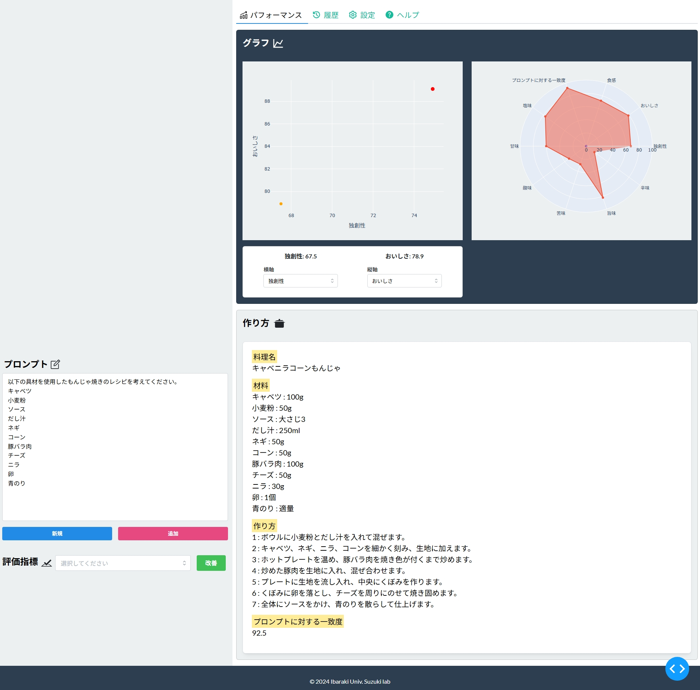
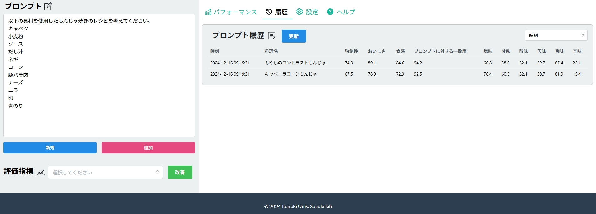

# Prototype of Recipe Creation System with ChatGPT
ChatGPTのAPIを用いて料理レシピの考案、評価、比較ができるツールです。  
ユーザーが入力したプロンプトを基に、AI(ChatGPT)が料理名・材料・作り方を生成し、評価指標とともに表示します。本システムは卒業研究として開発しました。

## Screenshots
### 一覧画面


### 履歴画面

## System Overview
ユーザーが入力した料理のアイデアからChatGPTを利用してレシピを生成します。

生成される情報
- 料理名
- 材料
- 作り方
- 味評価（独創性 / おいしさ / 食感 など）
また、生成されたレシピはCSVに保存され、グラフによる可視化も可能です。

## Ingredient Optimization (Research)
卒業研究では、もんじゃ焼きの具材の組合せを決定するため、
**Optunaによるベイズ最適化**を用いて具材の組合せ探索を行いました。
約80種類の候補具材について「入れる / 入れない」を探索変数とし、  
ChatGPTが具材の組合せを **調和性（Harmony）** の観点から評価します。

### Optimization Flow
Candidate Ingredients (~80)
↓
Optuna (Bayesian Optimization)
↓
ChatGPT Evaluation
↓
Best Ingredient Combination (~10)
↓
Recipe Generation System

※この最適化処理は研究用Notebookとして実装されています。  
料理レシピ作成システム（Webアプリケーション）は具材最適化を行わなくても利用可能です。

## Project Structure
```
recipe
│
├─ data
│ └─ generated recipes (CSV)
│
├─ docs
│
├─ notebooks
│ └─ ingredient_optimization.ipynb
│
├─ src
│ ├─ main.py
│ ├─ assets
│ │ └─ img
│ └─ components
│
└─ requirements.txt
```
## System Architecture
User Input  
↓  
ChatGPT API  
↓  
Recipe Generation (JSON format)  
↓  
Dash Web Application  
↓  
Visualization (Plotly)

## Tech Stack
- Python
- Dash
- OpenAI API
- Pandas
- Plotly
- Optuna (ingredient optimization)

## Installation
必要ライブラリをインストール
pip install -r requirements.txt

## Run
cd src
python app.py

ブラウザで
http://127.0.0.1:8050
にアクセスするとWebアプリが起動します。

## Example
### Input Prompt
以下の具材を使用したもんじゃ焼きのレシピを考えてください。
- 小麦粉
- 水
- ウスターソース
- 白だし
- キャベツ
- "+" 最適化された具材

※卒業研究では、上記の必須具材に加えてOptunaによる具材最適化で選ばれた具材をプロンプトに入力していました。
なお、本システムは具材指定を行わなくても利用可能であり、  
任意の料理アイデアや具材を入力してレシピを生成することができます。
例：夏に合うさっぱりしたパスタのレシピを考えてください。

### System Behavior
1. 「新規」ボタンを押す  
2. ChatGPTが3つのレシピを生成  
3. 「追加」ボタンでさらに1つのレシピを生成  
4. 生成されたレシピを比較

## Author
Taisei Arisaka
